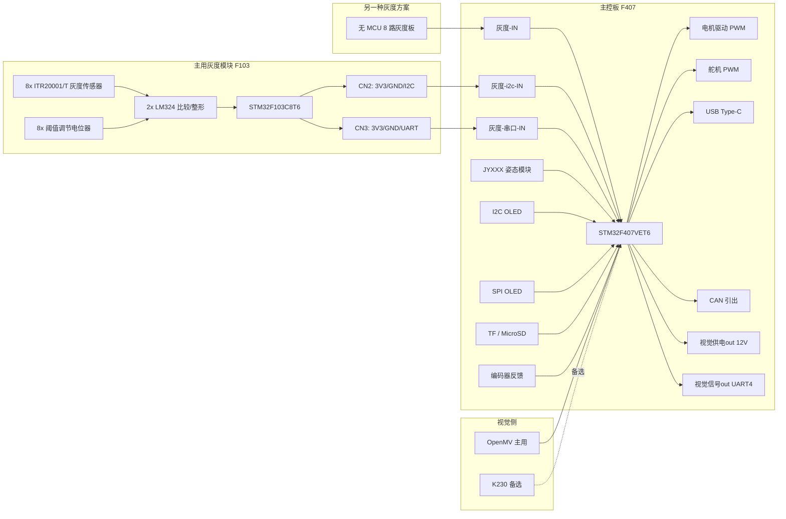

# F103 与 F407 系统结构梳理（确认版）

- 日期：2026-05-13
- 工作区：`D:\A_5.13_SJ_HD_F407_F103_K230_XiaoChe`
- 目的：结合源码、网表和已确认设计意图，输出一版更接近真实系统的结构说明。

## 1. 本版已确认的设计决策

以下 3 点已经确认，不再按“推测”处理：

- `F103` 是主用灰度模块。
- `F407` 上的 `灰度-IN` 对应另一块“无 MCU 的 8 路灰度板”。
- 视觉侧最终准备接 `OpenMV`，`K230` 作为备选方案。

## 2. 依据来源

本版结论来自三类证据：

- STM32 工程源码
  - `F103 grayscale sensor(HD)\code\4.28_test\*.ioc / Core\Src\*.c`
  - `F407 main control panel\code\AAA_F407VET6_5.6_Test\*.ioc / Core\Src\*.c`
- 原理图网表
  - `F103 grayscale sensor(HD)\PCB schematic diagram\F103 grayscale sensor.enet`
  - `F407 main control panel\PCB schematic diagram\F407 main control panel.enet`
- 设计意图确认
  - `F103` 为主用灰度模块
  - `灰度-IN` 属于另一块无 MCU 灰度板
  - `OpenMV` 为主路线，`K230` 为备选

## 3. F103 模块定位

### 3.1 角色结论

`F103` 现在应当明确理解为：

- 主用灰度模块
- 智能灰度子板
- 不是单纯测试板，也不是默认备用方案

### 3.2 结构特征

从网表可以直接确认，`F103` 板上包含：

- `8x ITR20001/T` 灰度反射式传感器
- `2x LM324` 比较/整形级
- `8x` 独立阈值调节电位器
- `STM32F103C8T6`
- I2C 对外口
- UART 对外口
- 多个通道指示灯

这说明 `F103` 的系统分工不是“采原始模拟量然后交给主控”，而是：

- 先在本板上完成灰度采集
- 再做比较/整形
- 最后由 `F103` 自己处理并通过 I2C 或 UART 对外通信

### 3.3 固件现状与硬件定位的区别

当前 `F103` 的 `main.c` 里只跑了很轻量的 IO 测试逻辑，但这只能说明：

- 当前提交的固件还很早期

不能说明：

- 硬件本身很简单
- 这块板只是测试板

硬件复杂度和系统角色已经被网表坐实。

## 4. F407 模块定位

### 4.1 角色结论

`F407` 是整个系统的主控与集成中心。

它当前已经铺好的硬件能力包括：

- 灰度输入
- I2C / UART 外设扩展
- 姿态模块接口
- OLED 显示
- TF / MicroSD
- 电机驱动 PWM
- 编码器反馈
- 舵机 PWM
- USB
- CAN 引出
- 视觉模块供电与串口

### 4.2 电源结构

从网表可以确认主电源链路为：

- `XT30` 电源输入
- 保险丝
- 电源拨动开关
- `12V` 母线
- DCDC 转 `3.3V`

所以：

- `F407` 主板的主供电入口是 `12V`
- Type-C 主要是 USB 通讯/识别，不是主电源入口

## 5. 灰度链路的真实结构

### 5.1 F407 上存在两套灰度接入思路

第一套：

- `灰度-IN`
- 8 路原始数字灰度线直接进 `F407`
- 对应另一块“无 MCU 的 8 路灰度板”

第二套：

- `灰度-i2c-IN`
- `灰度-串口-IN`
- 对应 `F103` 这类智能灰度模块

### 5.2 F103 与 F407 的通信关系

`F103` 的外部接口：

- `CN2 = 3V3 / GND / I2C`
- `CN3 = 3V3 / GND / UART`

`F407` 的对应接口：

- `灰度-i2c-IN = 3V3 / GND / I2C3`
- `灰度-串口-IN = 3V3 / GND / USART6`

结合网表与源码，这两组接口在脚位顺序上是高度匹配的。

因此当前最合理的系统理解是：

- `F103` 通过 `I2C3` 和/或 `USART6` 与 `F407` 对接
- `F407` 的 `灰度-IN` 不是接 `F103`，而是接另一块无 MCU 灰度板

## 6. 视觉链路的真实结构

### 6.1 已确认的主路线

视觉主路线：

- `OpenMV`

视觉备选路线：

- `K230`

### 6.2 F407 提供给视觉侧的接口

从网表可以确认：

- `视觉供电out = GND + 12V`
- `视觉信号out = UART4`

因此视觉侧设计意图很明确：

- `F407` 给视觉模块提供独立供电
- `F407` 通过 UART4 与视觉模块通信

### 6.3 当前更合理的视觉结论

- `OpenMV` 是预计优先接入的视觉模块
- `K230` 保留为备选，不是当前主路线
- 工作区里 `K230 Visual module(SJ)` 和 `OpenMV Visual module(SJ)` 的目录规划与这套硬件接口是吻合的

## 7. 其它关键模块关系

### 7.1 姿态模块

姿态模块在网表里是独立器件：

- `U4 = JYXXX 陀螺仪`

它同时连到了：

- `I2C2`
- `USART3`

所以这一块不是纯猜测，而是硬件上确实留了两种通信方式。

### 7.2 显示模块

板上不是一套 OLED 命名混乱，而是两套显示方案并存：

- `U5`：I2C OLED，走 `I2C1`
- `U6`：SPI OLED，走 `SPI2 + GPIO`

### 7.3 存储

`MicroCD` 与源码中的 `SPI1` 完全对上，说明：

- TF / MicroSD 存储链路成立

### 7.4 执行器与反馈

当前可以较稳地理解为：

- `TIM1 + TIM2`：电机或执行器驱动 PWM
- `TIM12`：两路舵机 PWM
- `TIM3 + TIM4`：两组编码器反馈

### 7.5 CAN

目前网表里只看到：

- MCU 的 CAN 引脚被直接引出到接口

还没有看到板载 CAN 收发器，因此当前更像：

- CAN 信号引出
- 或调试/后续扩展接口

## 8. 当前最接近真实设计意图的结构图

## 9. 现在还值得继续确认的点

- `F103` 与 `F407` 的主链路最终以 `I2C` 为主，还是以 `UART` 为主？
- `OpenMV` 输出给 `F407` 的协议层级是什么：识别结果、坐标、状态字，还是更底层数据？
- `YJXXX` 在实物上是否真的同时接了 UART 和 I2C，还是其中一路只是预留？
- `CAN.1 / CAN.2` 后续是否还会外挂收发器？
