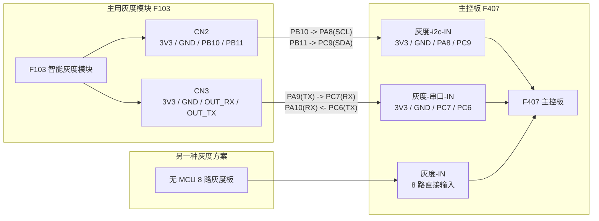

# F103 与 F407 精确对接图

- 日期：2026-05-14
- 工作区：`D:\A_5.13_SJ_HD_F407_F103_K230_XiaoChe`
- 目的：把主用灰度模块 `F103` 与主控板 `F407` 的实际对接关系画清楚。

## 1. 对接结论

当前已确认的系统关系如下：

- `F103` 是主用灰度模块
- `F407` 是主控板
- `F103` 不接 `F407` 的 `灰度-IN`
- `F103` 对接 `F407` 的：
  - `灰度-i2c-IN`
  - `灰度-串口-IN`
- `F407` 的 `灰度-IN` 留给另一块无 MCU 的 8 路灰度板

## 2. I2C 对接表

`F103` 侧接口：`CN2`

`F407` 侧接口：`灰度-i2c-IN`

| F103 CN2 | 信号 | F407 灰度-i2c-IN | F407 资源 |
| --- | --- | --- | --- |
| pin1 | `3V3` | pin1 | `3.3V` |
| pin2 | `GND` | pin2 | `GND` |
| pin3 | `PB10` | pin3 | `PA8 = I2C3_SCL` |
| pin4 | `PB11` | pin4 | `PC9 = I2C3_SDA` |

说明：

- `F103` 端 `PB10/PB11` 来自 `I2C2`
- `F407` 端 `PA8/PC9` 来自 `I2C3`
- 两边接口顺序是可直接对位的

## 3. UART 对接表

`F103` 侧接口：`CN3`

`F407` 侧接口：`灰度-串口-IN`

| F103 CN3 | 标注名 | 实际 MCU 含义 | F407 灰度-串口-IN | F407 资源 |
| --- | --- | --- | --- | --- |
| pin1 | `3V3` | 电源 | pin1 | `3.3V` |
| pin2 | `GND` | 地 | pin2 | `GND` |
| pin3 | `OUT_RX` | `PA9 = USART1_TX` | pin3 | `PC7 = USART6_RX` |
| pin4 | `OUT_TX` | `PA10 = USART1_RX` | pin4 | `PC6 = USART6_TX` |

说明：

- `F103` 这组 `OUT_RX / OUT_TX` 是按对端视角命名的
- 实际连接效果是：
  - `F103 TX -> F407 RX`
  - `F103 RX <- F407 TX`
- 这组脚位顺序也是天然可直连的

## 4. 另一块灰度板的位置

`F407` 的 `灰度-IN` 不是接 `F103`，而是接另一块无 MCU 的 8 路灰度板。

对应关系：

| F407 灰度-IN | F407 MCU 引脚 |
| --- | --- |
| pin3 | `PE2` |
| pin4 | `PE3` |
| pin5 | `PE4` |
| pin6 | `PE5` |
| pin7 | `PE6` |
| pin8 | `PC13` |
| pin9 | `PC0` |
| pin10 | `PC1` |

## 5. 精确对接图

## 6. 当前最稳的工程理解

- `F103` 是带本地处理能力的灰度模块
- `F407` 兼容两种灰度来源：
  - 智能灰度模块 `F103`
  - 无 MCU 的原始 8 路灰度板
- `F103 <-> F407` 的 I2C 和 UART 对接都已经具备硬件直连条件

## 7. 还值得继续确认的点

- 实际系统里 `F103` 与 `F407` 的主链路是 `I2C` 还是 `UART`
- 两条链路是否会同时保留：
  - 一条做主数据通道
  - 一条做调试或备用通道

