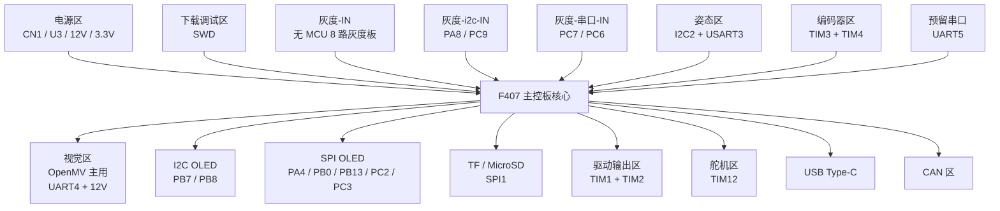

# F407 全板接口分区图

- 日期：2026-05-14
- 工作区：`D:\A_5.13_SJ_HD_F407_F103_K230_XiaoChe`
- 目的：把 `F407` 主控板的外部接口按功能分区整理，方便后续接线、联调和文档化。

## 1. 分区总览

`F407` 主板当前可以按下面几块理解：

- 电源区
- 下载调试区
- 灰度输入区
- 视觉接口区
- 姿态传感区
- 显示区
- 存储区
- 执行器驱动区
- 编码器反馈区
- 舵机区
- USB 区
- CAN 区
- 预留扩展区

## 2. 接口分区表

| 分区 | 接口/器件 | 主要信号 | 作用 |
| --- | --- | --- | --- |
| 电源区 | `CN1` | `12V` 输入 | 主电源入口 |
| 电源区 | `U3` DCDC | `12V -> 3.3V` | 主板降压 |
| 电源区 | `视觉供电out` | `GND + 12V` | 给视觉模块供电 |
| 下载调试区 | `下载` | `SWDIO + SWCLK + GND` | 下载调试 |
| 灰度输入区 | `灰度-IN` | `PE2 PE3 PE4 PE5 PE6 PC13 PC0 PC1` | 无 MCU 灰度板直接输入 |
| 灰度输入区 | `灰度-i2c-IN` | `PA8 + PC9` | 智能灰度模块 I2C 输入 |
| 灰度输入区 | `灰度-串口-IN` | `PC7 + PC6` | 智能灰度模块 UART 输入 |
| 视觉接口区 | `视觉信号out` | `PA1 + PA0` | `UART4` 视觉通讯 |
| 姿态传感区 | `U4` | `PB10 PB11 PD8 PD9` | `I2C2 + USART3` |
| 显示区 | `U5` | `PB7 + PB8` | `I2C OLED` |
| 显示区 | `U6` | `PA4 PB0 PB13 PC2 PC3` | `SPI OLED` |
| 存储区 | `MicroCD` | `PA5 PA6 PA7 PC4 PC5` | `SPI1 TF/MicroSD` |
| 执行器驱动区 | `U2` | `PA2 PA3 PB3 PA15 PE9 PE11 PE13 PE14` | 电机/驱动输入 |
| 编码器反馈区 | `CN2` | `PB5 PB4 PD13 PD12` | `TIM3 + TIM4` 编码器 |
| 舵机区 | `PWM.1 / PWM.2` | `PB14 / PB15` | `TIM12` 两路 PWM |
| USB 区 | `Type-c` | `PA9 PA11 PA12` | USB 通讯 |
| CAN 区 | `CAN.1 / CAN.2` | `PD0 PD1 / PB12 PB6` | CAN 信号引出 |
| 预留扩展区 | `预留串口` | `PC12 + PD2` | `UART5` 预留 |

## 3. 分区图

## 4. 视觉区说明

当前视觉侧应按下面理解：

- 主路线：`OpenMV`
- 备选：`K230`

`F407` 给视觉侧提供：

- `12V` 供电
- `UART4` 通讯

因此后续如果先接 `OpenMV`，最直接的主板接口就是：

- `视觉供电out`
- `视觉信号out`

## 5. 灰度区说明

`F407` 同时支持两套灰度输入体系：

第一套：

- 无 MCU 灰度板
- 通过 `灰度-IN` 直接进主控 GPIO

第二套：

- 主用智能灰度模块 `F103`
- 通过 `灰度-i2c-IN`
- 和/或 `灰度-串口-IN`

这意味着主控板在灰度侧是双兼容架构。

## 6. 接线时最容易混淆的点

- `灰度-IN` 不接 `F103`
- `F103` 走的是 `灰度-i2c-IN` / `灰度-串口-IN`
- 视觉主路线是 `OpenMV`，不是 `K230`
- `CAN.1 / CAN.2` 当前只是信号引出，不等于板上已经有 CAN 收发器
- 板上同时存在 `I2C OLED` 和 `SPI OLED` 两套显示方案

## 7. 后续最适合继续补的资料

- `F407` 全接口针脚对照表
- `OpenMV <-> F407` 通讯协议草案
- `F103 <-> F407` I2C/UART 报文定义
- 无 MCU 灰度板的 8 路信号定义表

